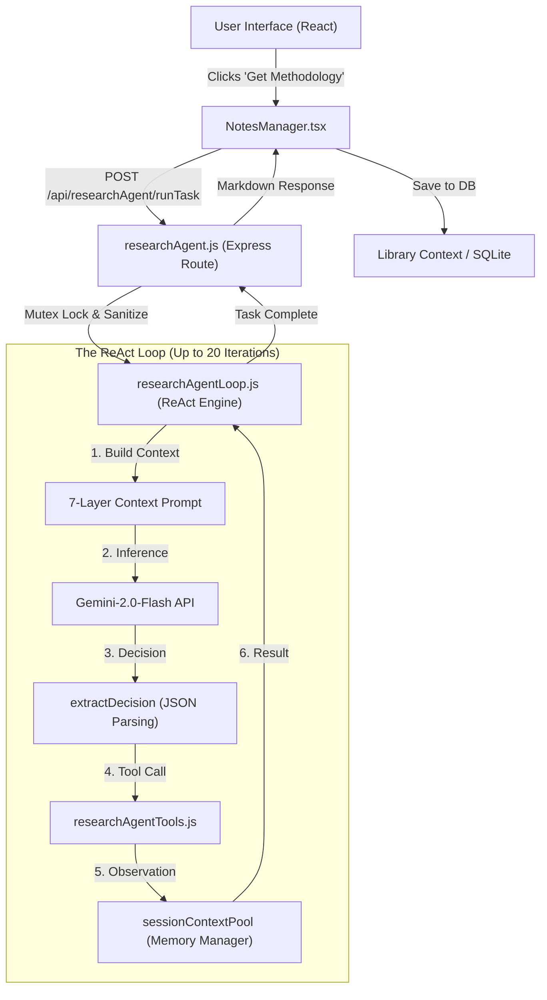

# 🎓 THE ULTIMATE RESEARCH AGENT MASTER GUIDE: DEVELOPER'S BLUEPRINT (v20.0)

This is the definitive, line-by-line technical manual for the **Research Agent Harness** implemented in this project. It is intended for developers who need to understand, maintain, or replicate the agentic infrastructure from scratch. 

---

## 🏛️ CHAPTER 1: THE PHILOSOPHY OF THE "AGENT HARNESS"

An LLM on its own is a "brain in a jar." It has high reasoning capability but **three critical limitations**:
1.  **Statelessness**: It forgets everything as soon as the request ends.
2.  **Context Caps**: It cannot "read" a 100-page PDF in one prompt without losing focus (the "Lost in the Middle" problem).
3.  **Isolation**: It cannot autonomously click buttons, query databases, or save files.

The **"Harness"** is the software skeleton we build *around* the LLM to give it:
-   **Hands**: Tools (`researchAgentTools.js`)
-   **Memory**: A multi-tiered storage system (Short-term Pool vs. Long-term Context).
-   **Legs**: An iterative loop (`researchAgentLoop.js`) that runs until a task is solved.

### 1.5 System Architecture & Data Flow

To understand the system, one must visualize the asynchronous bridge between the browser and the AI engine.



---

## 🛠️ CHAPTER 1.6: ENVIRONMENT & SETUP

Before launching the agent, the backend must be provisioned with high-entropy API credentials.

1.  **API Keys**: Obtain a Google Gemini API Key from [Google AI Studio](https://aistudio.google.com/).
2.  **Configuration**: Create `backend/.env` and add:
    ```env
    GEMINI_API_KEY=your_key_here
    PORT=5000
    ```
3.  **Stability Note**: Ensure `node server.js` is restarted after any changes to tool definitions, as tools are loaded into memory at startup.

---

## 🎨 CHAPTER 2: FRONTEND ORCHESTRATION (`NotesManager.tsx`)

The frontend is the "Client" that initiates the research task. It manages a complex lifecycle of UI states, optimistic updates, and database persistence.

### 2.1 The handleRunAgentWorkflow Function
This function is the "Project Manager" for your agent. It manages the entire lifecycle of a research task.

#### Detailed Code Implementation & Reference Guide:
```typescript
/**
 * handleRunAgentWorkflow
 * 
 * This is the primary orchestrator that bridges the React UI with the Backend Agent API.
 * 
 * @param paper The currently active research paper object (metadata + uri).
 * @param workflowId The string identifier for the task (e.g., 'get_methodology').
 */
const handleRunAgentWorkflow = async (paper: any, workflowId: string) => {
  // 1. MUTEX LOCKING: Prevent concurrent runs for the same paper URI.
  // Academic papers are expensive to process. If a user clicks "Generate" twice,
  // we could double-spend tokens or cause a race condition on the database save.
  if (agentProcessingUris.has(paper.uri)) {
    console.debug("[NotesManager] Blocked concurrent agent run for:", paper.uri);
    return;
  }
  
  // Set the "Thinking" state in the UI for this specific paper.
  setAgentProcessingUris(prev => new Set(prev).add(paper.uri));

  // 2. DATA SEGMENTATION: Filter context to minimize token bloat.
  // We only send notes that are directly related to the current paper.
  const paperNotes = savedNotes.filter(n => (n.paper_uri || n.pdfUri) === paper.uri);

  // 3. THE 8-MINUTE ASYNC RACE (Safety Guardrail)
  // ReAct loops can take anywhere from 10 seconds to 5 minutes.
  try {
    const response = await Promise.race([
      api.researchAgent.runTask(
        `Perform ${workflowId} analysis for: "${paper.title}"`,
        [paper],
        paperNotes,
        workflowId
      ),
      new Promise((_, reject) => setTimeout(() => 
        reject(new Error('AGENT_TIMEOUT')), 480000))
    ]);

    // 4. PERSISTENCE: Mapping Workflow to UI Database Columns
    if (response?.success) {
      const fieldMap: Record<string, string> = {
        'literature_review': 'literature_review',
        'get_methodology': 'methodology',
        'get_findings': 'findings',
        'format_reference': 'harvardReference',
        'summarise_paper': 'abstract'
      };
      
      const targetField = fieldMap[workflowId];
      if (targetField) {
        await savePaper({ ...paper, [targetField]: response.response });
      }
    }
  } catch (err) {
    console.error("[NotesManager] Workflow Execution Error:", err);
  } finally {
    setAgentProcessingUris(prev => {
      const next = new Set(prev);
      next.delete(paper.uri);
      return next;
    });
  }
};
```

---

## 🚪 CHAPTER 2.2: THE API GATEWAY (`backend/routes/researchAgent.js`)

The backend endpoint acts as a gatekeeper, and most importantly, implements a **Server-Side Mutex** to prevent the same paper being analyzed by multiple concurrent processes.

```javascript
const activeTasks = new Set();

router.post('/runTask', async (req, res) => {
  const { task, workspace, workflowId } = req.body;
  const paperUri = workspace.papers[0]?.uri;

  if (activeTasks.has(paperUri)) {
    return res.status(429).json({ error: "Agent is already processing this paper." });
  }

  activeTasks.add(paperUri);
  try {
    const result = await runAgentTask(task, workspace, workflowId);
    res.json(result);
  } finally {
    activeTasks.delete(paperUri);
  }
});
```

---

## 🏗️ CHAPTER 3: THE HEART — THE ReAct LOOP (`researchAgentLoop.js`)

This file contains the **`runAgentTask`** function. It executes the **Reason-Act-Observe** pattern for up to **20 iterations**.

### 3.1 The 7-Layer Context Strategy (The Secret Sauce)
To maintain "Context Hygiene," we rebuild the entire prompt from scratch every single iteration. This prevents the agent from getting lost in a long chain of historical tool outputs.

#### EXHIBIT A: The `buildContext` Implementation:
```javascript
/**
 * buildContext
 * 
 * Rebuilds the prompt from scratch to maintain focus.
 */
function buildContext(task, workspace, executionLog, sessionMemory, recentObservations, workflow) {
  // LAYER 0: Systems Identity (The Prime Directive)
  // Purpose: Establishes the agent's persona and core rules. 
  const layer0 = "You are a PhD Research Assistant. RULE: Do not hallucinate. Cite everything.";

  // LAYER 1: Tools Catalog (The Manual)
  // Purpose: Defines the 'capabilities list' for the model's action selection.
  const layer1 = "\nAVAILABLE TOOLS:\n" + TOOL_SCHEMA.map(t => `- ${t.name}`).join('\n');

  // LAYER 2: Workspace Environment (The Available Data)
  // Purpose: Provides count of papers and titles so the agent knows what indices to use.
  const layer2 = `\nWORKSPACE STATE:\n- Papers: ${workspace.papers.length}`;

  // LAYER 2b: Targeted Procedural Instruction (The Strategy)
  // Purpose: Inject a specific 'Plan of Attack' into the agent's reasoning.
  const layer2b = workflow ? `\nWORKFLOW GUIDELINE:\n${workflow}` : '';

  // LAYER 3: Long-Term Structured Memory (The "Pins")
  // Purpose: This is the persistent workspace where key facts are 'pinned' so they survive all iterations.
  const layer3 = `\nSAVED FINDINGS:\n${sessionMemory.map(m => m.content).join('\n')}`;

  // LAYER 4: Execution Log (Short-Term Action Trail)
  // Purpose: Prevents the agent from looping or trying the same tool with failed parameters twice.
  const layer4 = `\nACTIONS TAKEN:\n${executionLog.map(e => e.tool).join('\n')}`;

  // LAYER 5: Last Observation (The Current "Input")
  // Purpose: Provides the raw data (e.g., page text) for the agent to analyze in this turn.
  const layer5 = `\nLAST TOOL OUTPUT:\n${recentObservations[0]}`;

  // LAYER 6: Output Contract (The Syntax Hammer)
  // Purpose: Forces the LLM into a machine-readable JSON format for the loop parser.
  const layer6 = "\nRESPONSE RULE: JSON ONLY. Format: { \"actions\": [...] }";

  return [layer0, layer1, layer2, layer2b, layer3, layer4, layer5, layer6].join('\n');
}
```

---

## 🧠 CHAPTER 4: THE POOL & POINTER SYSTEM (`researchAgentTools.js`)

Memory is handled via a server-side storage object called `sessionContextPool`. This solves the token limit problem by using IDs instead of text strings in the prompt history.

### 4.1 How it Works:
1.  **Generate ID**: The tool fetched data and generates a unique ID (Pointer).
2.  **Store Data**: The full 5,000 character text is stored in `sessionContextPool[ID]`.
3.  **Return Pointer**: The agent sees ONLY the pointer `[MEMORY_ID: 12345]`.
4.  **Recall**: The agent calls `save_to_session_memory(["12345"])`.
5.  **Promotion**: The full text is "promoted" to Layer 3 and stays there forever.

### 4.2 Why this is Token Optimization Genius:
-   Without this: If the agent reads 10 pages, the history ballooned to 50,000 characters. By iteration 10, the prompt hits the limit.
-   With this: The history only contains small summaries (`resultSummary`) and unique IDs. Only the *currently relevant* page is in Layer 5.

---

## 🏗️ CHAPTER 5: SUB-AGENT ORCHESTRATION (`generateStructureMap`)

High-level navigation is achieved by spawning a "Sub-Agent" (a focused model call) inside the tool executor.

### 5.1 The Structure Map Logic:
The agent cannot "scroll" through 100 pages. To solve this, `get_paper_structure_map` takes the first 50 pages of a paper, sends them to a dedicated Gemini call, and asks for a Table of Contents.

```javascript
// From researchAgentTools.js
case 'get_paper_structure_map': {
  const pagesToAnalyze = paper.pages.slice(0, 50);
  const textToAnalyze = pagesToAnalyze.map((text, i) => `--- PAGE ${i + 1} ---\n${text}`).join('\n\n');
  
  const prompt = `Analyze the following academic text... and construct a Table of Contents.`;
  const model = genAI.getGenerativeModel({ model: 'gemini-2.0-flash' });
  const result = await model.generateContent(prompt);
  const structure = result.response.text();
  
  return {
    observation: `GENERATED STRUCTURE MAP:\n${structure}`,
    memoryType: 'long_term',
    memoryEntry: { type: 'structure', content: structure }
  };
}
```
This tool is **Automatically Long-Term**. Once the map is generated, it stays in the context forever, serving as a roadmap for all subsequent page-reading operations.

---

## ⚙️ CHAPTER 6: DECISION PARSING & ROBUST EXTRACTION

AI models often hallucinate "preamble" text or wrap JSON in markdown blocks like ```json ... ```. Our `extractDecision` function is designed to handle these common failure modes.

### 6.1 The 3-Strategy Parsing Logic:
1.  **Code Fence Strip**: If Gemini returns ```json { ... } ```, we strip the fences.
2.  **Brace-Anchor Search**: We search for the first `{` and the last `}`. This ignores any "Sure! Here is the JSON:" text added by the model.
3.  **Bracket Fallback**: If the model forgets the `{ "actions": [] }` wrapper and just returns `[ { ... } ]`, we wrap it for them.

```javascript
function extractDecision(responseText) {
  // Strategy 1: Code Fences
  const fenceMatch = cleaned.match(/```(?:json)?\s*([\s\S]*?)\s*```/);
  if (fenceMatch) cleaned = fenceMatch[1].trim();

  // Strategy 2: First { to Last }
  const firstBrace = cleaned.indexOf('{');
  const lastBrace = cleaned.lastIndexOf('}');
  if (firstBrace !== -1 && lastBrace !== -1) {
    return JSON.parse(cleaned.substring(firstBrace, lastBrace + 1));
  }
}
```

---

## 🛡️ CHAPTER 7: CRITICAL SAFETY ARCHITECTURE

### 7.1 Action Normalization
Models frequently mistake `task_complete` for a tool call. Our loop "normalizes" this automatically.

```javascript
if (act.action === 'tool_call' && act.tool === 'task_complete') {
  act = { action: 'task_complete', params: act.params };
}
```

### 7.2 The "React Object Rendering" Crash Protection
In `NotesManager.tsx`, the final response is rendered inside a `<div>{response}</div>`. If the AI returns a JSON object instead of a string, React crashes.
**Solution**: We check for objects in the backend loop and flatten them into a Markdown list before returning to the UI.

```javascript
if (typeof finalResponse === 'object' && finalResponse !== null) {
  finalResponse = Object.entries(finalResponse)
    .map(([key, value]) => `### ${key}\n${String(value)}`)
    .join('\n\n');
}
```

---

## 🛠️ CHAPTER 8: FULL TOOL SCHEMA REFERENCE

Below is the complete `TOOL_SCHEMA` the agent uses to perform research:

```javascript
[
  {
    name: 'get_and_read_page_content',
    description: `Read specific page text. SHORT-TERM ONLY. Returns [MEMORY_ID: X].`,
    parameters: { type: 'OBJECT', properties: { paper_index: { type: 'NUMBER' }, page_number: { type: 'NUMBER' } } }
  },
  {
    name: 'save_to_session_memory',
    description: `Transition content to PERMANENT context memory using their [MEMORY_ID: X].`,
    parameters: { type: 'OBJECT', properties: { memory_ids: { type: 'ARRAY', items: { type: 'STRING' } } } }
  },
  {
    name: 'search_keyword',
    description: `Search for a keyword across all pages. Returns page numbers.`,
    parameters: { type: 'OBJECT', properties: { paper_index: { type: 'NUMBER' }, keyword: { type: 'STRING' } } }
  }
]
```

---

## 🚀 CHAPTER 9: WORKFLOW INJECTION STRATEGIES

Workflows are "Preloaded Guidance" that steer the agent's reasoning.

### 9.1 Literature Review Workflow:
**Primary Objective**: Synthesizing current paper with student notes.
**Prompt Strategy**: 
1. `list_workspace` to identify paper and notes.
2. `get_notes_for_paper` to pull the student's previous thoughts.
3. `get_and_read_multiple_pages` to find evidence.
4. Synthesize.

---

## 📋 CHAPTER 10: TROUBLESHOOTING MATRIX

| Issue | Root Cause | Solution |
| :--- | :--- | :--- |
| **"Memory ID Not Found"** | Agent tried to save in Action 2 of a chain. | Use `save_to_session_memory` in Action 1 only. |
| **"Unknown Tool"** | Agent called `task_complete` incorrectly. | Use the Normalization layer in Loop.js. |
| **"Token Cap"** | Context too long. | Loop rebuilds context every turn. |
| **"React Crash"** | Object returned as response. | Stringification check in `runAgentTask`. |

---

## ✨ CHAPTER 11: FUTURE ENHANCEMENTS & SCALABILITY

#### 11.1 Multi-Paper Synthesis
The code is currently architected to take an array of `papers`. You can easily add a workflow that asks the agent to compare two papers side-by-side using the `paper_index` parameter in tool calls.

#### 11.2 Structured Data Export
Integrating with CSV or JSON exporters would allow researchers to generate metadata sheets for thousands of papers using this same iterative engine.

---

## 🏗️ CHAPTER 11.3: EXTENSIBILITY — ADDING NEW TOOLS

The system is designed to be "Pluggable." To add a new capability:

1.  **Define Schema**: Open `researchAgentTools.js` and add a new entry to `TOOL_SCHEMA`.
2.  **Implement Logic**: Add a new `case` to the `executeTool` switch statement.
3.  **Return Observation**: Ensure you return an `{ observation: string }` object.
4.  **Register ID (Optional)**: If the output is large, save it to `sessionContextPool` and return a `[MEMORY_ID: X]`.

**Example: Adding a "Translate Page" tool**:
```javascript
// 1. Schema
{
  name: 'translate_page',
  description: 'Translates a page into another language.',
  parameters: { type: 'OBJECT', properties: { page: { type: 'NUMBER' }, lang: { type: 'STRING' } } }
}

// 2. Logic
case 'translate_page':
  const text = paper.pages[params.page - 1];
  const translated = await callTranslator(text, params.lang);
  return { observation: translated };
```

---

## 🏗️ CHAPTER 11.4: RESEARCH-AS-A-SERVICE (THE AGENT API)

The Research Agent Harness is inherently stateless, making it trivial to expose as a **Synthesis API**. In this scenario, a third-party application sends a batch of URLs, context, and a goal, and receiving a final academic report.

**Example API Payload**:
```json
{
  "task": "Synthesize the impact of Merit-Order Effect based on these three papers.",
  "paper_urls": [
    "https://arxiv.org/pdf/1234.5678.pdf",
    "https://arxiv.org/pdf/9876.5432.pdf"
  ],
  "additional_context": "The audience is policy makers in the EU energy sector."
}
```

**How it Works**:
The backend route would fetch and parse the PDF URLs, populate the `workspace.papers` array, and initiate the `runAgentTask`. The ReAct loop then performs the multi-paper analysis and returns the `finalResponse` as a JSON payload.

---

## 🏗️ CHAPTER 11.5: THE AUTONOMOUS DOCUMENT WRITER (THEORETICAL)

> [!IMPORTANT]
> **ARCHITECTURAL VISION**: The functionality described in Chapter 11.5 and 11.6 is a **theoretical expansion** and is not currently implemented in the `research-note` production environment. These sections serve as a blueprint for developers wishing to extend the Research Engine into a Document Production Engine.

By adding "Writer Tools," the agent harness would transition from a **Research Engine** to a **Production Engine**. The same ReAct loop currently used to analyze PDFs could be used to draft a thesis, update a discussion section, or summarize complex results into a formal introduction.

### Implementation Strategy:
We would introduce two primary tools into the `TOOL_SCHEMA` to bridge the gap between the agent's memory and the user's document:

1.  **read_draft_document**: Loads the current state of a Word/Markdown draft into the `sessionContextPool`.
2.  **update_document_section**: Takes a string of generated prose and writes it back to a specific anchor/section in the draft.

**Example: The Writer Tool Implementation (Hypothetical)**
```javascript
// Inside executeTool(toolName, params, ...)
case 'update_document_section': {
  const { section_name, new_content } = params;
  // 1. Read document from disk (e.g., using mammoth.js or fs)
  const doc = await loadDraft(workspace.activeDocPath);
  
  // 2. Perform Atomic Replacement
  const updatedDoc = doc.replaceSection(section_name, new_content);
  
  // 3. Save and return confirmation to the agent
  await saveDraft(workspace.activeDocPath, updatedDoc);
  return { observation: `SUCCESS: Section "${section_name}" has been updated.` };
}
```

---

## 🖋️ CHAPTER 11.6: DEEP DIVE — THE WRITER'S WORKFLOW ENGINE (ARCHITECTURAL THEORY)

When a user asks: *"Use Note #4 to update my Discussion section,"* the harness would execute a specialized **Style-Aware ReAct Loop** following this logic.

### 1. Context Fetching (The Input Phase)
The agent calls `read_draft_document` and `get_notes_for_paper`. This puts the **Old Prose** and the **New Facts** into the Short-term Observation (Layer 5).

### 2. Style Matching (The Reasoning Phase)
The agent analyzes the tone of the "Old Prose." In its next `thinking` block, it identifies the academic register (e.g., "APA 7th Edition, formal tone, passive voice for methodology").

### 3. Atomic Drafting (The Action Phase)
Instead of rewriting the entire 20-page document, the agent generates prose *only* for the targeted section. This prevents context overflow and keeps the changes precise.

### 4. The Refinement Loop (Verification)
After calling `update_document_section`, the agent calls `read_draft_document` one more time. It reads its own generated prose to verify:
-   **Citation Accuracy**: Are all MEMORY_IDs correctly converted to Harvard References?
-   **Flow**: Does the new text transition smoothly into the next paragraph?

**The "Document Writer" Workflow Trace**:
1.  **User**: "Write my introduction using the Abstract and Note #1."
2.  **Iter 1**: `get_paper_metadata` (gets Abstract) + `list_workspace` (finds Note 1).
3.  **Iter 2**: `get_notes_for_paper` (reads Note 1).
4.  **Iter 3**: `read_draft_document` (identifies that Introduction is currently empty).
5.  **Iter 4**: `update_document_section` (writes the 300-word intro using Abstract and Note 1).
6.  **Iter 5**: `task_complete` ("Introduction written and integrated into the draft.")

---

## 📜 CHAPTER 12: LICENSE & LEGAL NOTICE

-   This software is for academic research and personal note-taking only.
-   The Gemini API usage is subject to Google's Terms of Service.
-   Do not use this agent to generate fraudulent research content.
-   Ensure all cited content is properly attributed.
-   The developer is not responsible for hallucinated research conclusions.
-   Always verify the [MEMORY_ID] pointers against the original PDF text.

---

## 🧪 CHAPTER 13: LIFE OF A REQUEST — A STEP-BY-STEP TRACE

To fully understand the agent, follow a single user request from start to finish:

1.  **Trigger**: User clicks "Get Findings" on "Paper A".
2.  **Frontend Orchestration**: `NotesManager.tsx` triggers `handleRunAgentWorkflow`. It sets a 480s timer and sends a POST request to `/api/researchAgent/runTask`.
3.  **API Bridge**: The backend route locks "Paper A" so no other work can happen on it. It initializes the `executionLog` and `workspace`.
4.  **Iteration 1**: 
    *   `buildContext` creates a prompt telling the agent to start researching.
    *   Gemini returns: `{ "actions": [{ "tool": "get_paper_metadata", "params": { "paper_index": 0 } }] }`.
    *   `executeTool` fetches the abstract and title. It saves this to `sessionMemory`.
5.  **Iteration 2**:
    *   `buildContext` now includes the abstract in Layer 3. 
    *   Gemini returns: `{ "actions": [{ "tool": "get_paper_structure_map", "params": { "paper_index": 0 } }] }`.
    *   Structure Map sub-agent summarizes the sections.
6.  **Iteration 3-5**:
    *   The agent uses the Structure Map to find the "Results" section (e.g. Page 12).
    *   It calls `get_and_read_page_content` for Page 12. 
    *   It sees the text and calls `save_to_session_memory` to keep the findings.
7.  **Final Iteration**:
    *   The agent has all the data in Layer 3 (Long-term memory).
    *   It calls `task_complete` with a 500-word academic synthesis.
8.  **Completion**: 
    *   The backend releases the Paper A lock.
    *   The frontend receives the JSON response, maps it to the `findings` database column, and saves the paper.
    *   The UI updates, replacing the spinner with the generated text.

---

**MASTER BLUEPRINT COMPLETE.**
*END OF MANUAL*