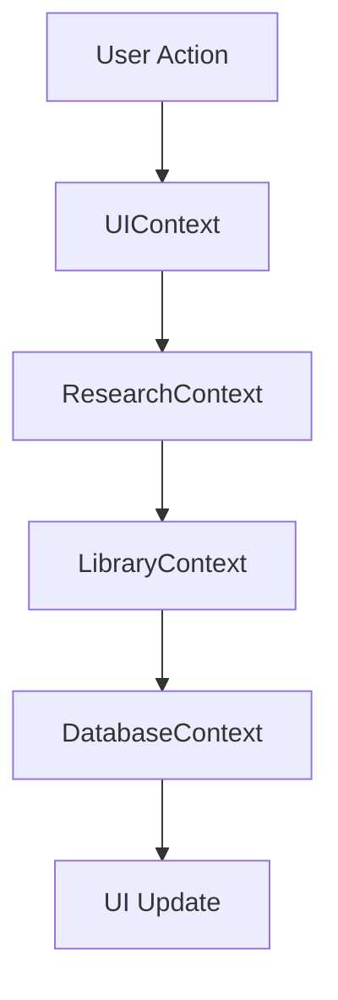
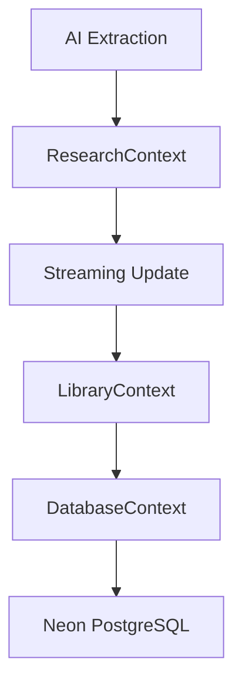

# Database Schema & State Management

## Database Architecture

### Neon PostgreSQL Schema

#### **Papers Table**
```sql
CREATE TABLE papers (
  uri TEXT PRIMARY KEY,                    -- PDF URL (unique identifier)
  title TEXT NOT NULL,                     -- Document title
  abstract TEXT,                           -- Summary/abstract text
  authors JSONB,                           -- Array of author names
  num_pages INTEGER,                       -- Total page count
  is_explicitly_saved BOOLEAN DEFAULT FALSE, -- User-saved vs auto-saved
  created_at TIMESTAMP WITH TIME ZONE DEFAULT CURRENT_TIMESTAMP
);
```

#### **Notes Table**
```sql
CREATE TABLE notes (
  id SERIAL PRIMARY KEY,                   
  paper_uri TEXT REFERENCES papers(uri) ON DELETE CASCADE,
  content TEXT NOT NULL,                   -- The actual quote/note text
  justification TEXT,                      -- AI's reasoning for extraction
  citations JSONB,                         -- Structured citation data
  related_question TEXT,                   -- Which research question answered
  page_number INTEGER,                     -- Source page in PDF
  relevance_score FLOAT,                   -- AI confidence score (0.0-1.0)
  is_starred BOOLEAN DEFAULT FALSE,        -- User favoriting
  is_flagged BOOLEAN DEFAULT FALSE,        -- User flagging for review
  created_at TIMESTAMP WITH TIME ZONE DEFAULT CURRENT_TIMESTAMP
);
```

#### **Folders Table**
```sql
CREATE TABLE folders (
  id SERIAL PRIMARY KEY,                   
  name TEXT NOT NULL,                      -- Folder name
  type TEXT NOT NULL,                      -- 'PROJECT' | 'SECTION' | 'GROUP'
  parent_id INTEGER REFERENCES folders(id) ON DELETE CASCADE,
  description TEXT,                        -- Optional description
  created_at TIMESTAMP WITH TIME ZONE DEFAULT CURRENT_TIMESTAMP
);
```

#### **Note Assignments Table**
```sql
CREATE TABLE note_assignments (
  id SERIAL PRIMARY KEY,
  note_id INTEGER REFERENCES notes(id) ON DELETE CASCADE,
  folder_id INTEGER REFERENCES folders(id) ON DELETE CASCADE,
  created_at TIMESTAMP WITH TIME ZONE DEFAULT CURRENT_TIMESTAMP,
  UNIQUE(note_id, folder_id)               -- Prevent duplicate assignments
);
```

## React Context State Management

### UIContext State Structure
```typescript
interface UIContextState {
  // Layout Management
  columnVisibility: { left: boolean; middle: boolean; library: boolean; right: boolean };
  columnLocks: { left: boolean; middle: boolean; library: boolean; right: boolean };
  
  // Theme & Appearance
  darkMode: boolean;
  isHomeExiting: boolean;
  
  // Library Interface
  isLibraryOpen: boolean;
  isLibraryExpanded: boolean;
  libraryActiveView: LibraryView; // 'all' | 'recent' | 'flagged' | 'starred' | 'papers'
  
  // Modal Management
  assignmentModal: {
    isOpen: boolean;
    note: DeepResearchNote | null;
    sourceMetadata: any;
  };
}
```

### ResearchContext State Structure  
```typescript
interface ResearchContextState {
  // Search Interface
  activeSearchMode: SearchMode; // 'web' | 'deep' | 'upload'
  searchState: {
    query: string;
    isLoading: boolean;
    data: SearchResultData | null;
    hasSearched: boolean;
    error: string | null;
  };
  
  // Multi-input Search Bar
  searchBarState: {
    mainInput: string;
    additionalTopics: string[];
    urls: (string | TagData)[];
    questions: string[];
    urlInput: string;
    questionInput: string;
  };
  
  // Search History  
  searchHistory: string[];
  
  // Deep Research Pipeline
  researchPhase: ResearchPhase; // 'idle' | 'initializing' | 'searching' | 'filtering' | 'extracting' | 'completed' | 'failed'
  gatheringStatus: string;
  arxivKeywords: string[];
  arxivCandidates: ArxivPaper[];
  filteredCandidates: ArxivPaper[];
  selectedArxivIds: Set<string>;
  
  // AI Extraction Results
  isDeepResearching: boolean;
  deepResearchResults: DeepResearchNote[];
  contextNotes: DeepResearchNote[]; // Notes selected for AI agent context
}
```

### LibraryContext State Structure
```typescript
interface LibraryContextState {
  // PDF Management
  loadedPdfs: LoadedPdf[];
  activePdfUri: string | null;
  contextUris: Set<string>; // PDFs selected for AI analysis
  
  // Download Tracking
  downloadingUris: Set<string>;
  failedUris: Set<string>;
  
  // PDF Interaction
  searchHighlight: string | null; // Text to highlight in PDF viewer
}
```

### DatabaseContext State Structure
```typescript
interface DatabaseContextState {
  // Cached Database Data
  savedPapers: any[];
  savedNotes: any[];
  isDbLoading: boolean;
  
  // Hierarchical Organization
  projectStructure: FolderNode[]; // Built from flat folders data
}
```

## State Flow Patterns

### Cross-Context Communication


### Data Persistence Flow


## Key Design Decisions

### Database Design Decisions

**URI as Primary Key for Papers:**
- **Rationale:** URLs are naturally unique and stable identifiers
- **Benefit:** Direct relationship between loaded PDFs and database records
- **Trade-off:** URL changes require manual intervention

**JSONB for Flexible Data:**
- **Usage:** Authors arrays, citations objects
- **Benefit:** Flexible schema without rigid structure
- **Performance:** Indexed JSONB queries for author searches

**Hierarchical Folders with Self-Reference:**
- **Pattern:** parent_id references folders.id
- **Benefit:** Unlimited nesting depth for organization
- **Complexity:** Recursive queries for tree building

### State Management Decisions

**Context Separation by Domain:**
- **Rationale:** Prevent coupling between unrelated concerns
- **Benefit:** Independent feature development and testing
- **Trade-off:** More complex inter-context communication

**Set Data Structures for Membership:**
- **Usage:** contextUris, downloadingUris, selectedArxivIds
- **Benefit:** O(1) membership testing and unique enforcement
- **Memory:** Efficient for sparse selections

**Streaming Updates Pattern:**
- **Implementation:** Callback functions passed to async operations
- **Benefit:** Real-time user feedback during long operations
- **Complexity:** Requires careful state management to avoid conflicts

## Performance Considerations

### Database Query Optimization

**Batch Loading Strategy:**
```typescript
// Single query to load all library data
const data = await dbService.getAllLibraryData();
// Returns: { papers: [], notes: [] }
```

**Memoized Existence Checks:**
```typescript
const isPaperSaved = useCallback((uri: string) => 
  savedPapers.some(p => p.uri === uri && p.is_explicitly_saved), 
  [savedPapers]
);
```

### Memory Management

**PDF Lifecycle:**
- **Loading:** ArrayBuffer stored in loadedPdfs array
- **Processing:** Text extraction creates pages array
- **Cleanup:** Component unmount removes from memory
- **Future:** LRU cache for memory-constrained environments

**Embedding Cache:**
```typescript
const embeddingCache = new Map<string, number[]>();
// 60%+ cache hit rate reduces API calls significantly
```

### State Update Optimization

**Immutable Updates:**
```typescript
// ResearchContext pattern for streaming updates
setFilteredCandidates(prev => prev.map(paper =>
  paper.id === targetId 
    ? { ...paper, notes: [...(paper.notes || []), ...newNotes] }
    : paper
));
```

**Controlled Re-renders:**
```typescript
// Hierarchical folder building with useMemo
const projectStructure = useMemo(() => {
  const buildTree = (parentId: number | null = null): FolderNode[] => {
    return folders.filter(f => f.parent_id === parentId)
      .map(f => ({ ...f, children: buildTree(f.id) }));
  };
  return buildTree(null);
}, [folders]);
```

This database and state management architecture provides **scalable, maintainable, and performant** foundation for the Research Note application's complex research workflows.