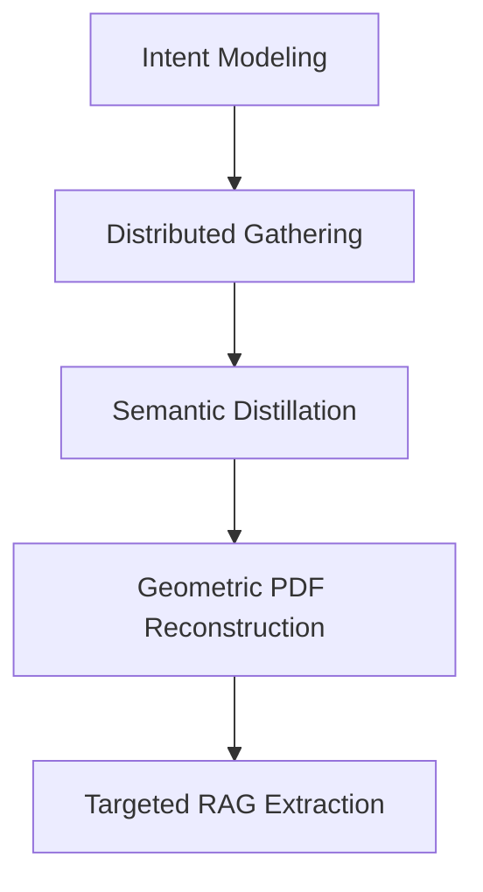

# System Patterns - Research Note Architecture

## Domain-Driven Context Architecture

### Core Architectural Pattern

Research Note uses a **Domain-Driven Context Architecture** that separates concerns into specialized state management domains. This prevents state coupling and ensures clean separation of responsibilities.

```typescript
App.tsx (Root Component)
├── UIContext (Interface & Layout Management)
├── ResearchContext (AI Pipeline & Search State)
├── LibraryContext (PDF Management & Workspace)
└── DatabaseContext (Persistence & Organization)
```

### Context Responsibility Matrix

| Context | Primary Responsibility | Key State | Inter-Context Communication |
|---------|----------------------|-----------|----------------------------|
| **UIContext** | Layout, animations, theme | Column visibility, dark mode | Triggers other contexts |
| **ResearchContext** | AI processing, search | Pipeline phases, results | Streams to Library |
| **LibraryContext** | PDF management, workspace | Loaded files, active PDF | Provides data to Research |
| **DatabaseContext** | Persistence, organization | Saved notes, folder structure | Persists from other contexts |

### Context Interaction Patterns

**1. Event-Driven Communication**
```typescript
// Example: User clicks "View PDF"
const handleViewPdf = async (source) => {
  const success = await loadPdfFromUrl(source.uri); // LibraryContext
  if (success) {
    setActivePdf(source.uri);                      // LibraryContext
    openColumn('right');                           // UIContext
    togglePdfContext(source.uri);                  // LibraryContext
  }
};
```

**2. State Synchronization Pattern**
```typescript
// Real-time updates across contexts
const onStreamNotes = (newNotes: DeepResearchNote[]) => {
  // ResearchContext updates filteredCandidates
  setFilteredCandidates(prev => prev.map(paper =>
    paper.id === targetPaperId 
      ? { ...paper, notes: [...(paper.notes || []), ...newNotes] }
      : paper
  ));
};
```

## AI Processing Patterns

### Async Pool Pattern for Controlled Concurrency

**Core Implementation:**
```typescript
async function asyncPool<T, R>(
  concurrency: number, 
  items: T[], 
  worker: (item: T) => Promise<R>
): Promise<R[]> {
  const results: R[] = new Array(items.length);
  let i = 0;

  async function runNext() {
    const index = i++;
    if (index >= items.length) return;
    try { 
      results[index] = await worker(items[index]); 
    } catch (e) { 
      console.error(e); 
    }
    return runNext();
  }

  const workers = Array.from(
    { length: Math.min(concurrency, items.length) }, 
    () => runNext()
  );
  await Promise.all(workers);
  return results;
}
```

**Usage Pattern:**
```typescript
// Process PDFs with controlled concurrency
const PAPER_CONCURRENCY = 3;
await asyncPool(PAPER_CONCURRENCY, papers, async (paper) => {
  // Download → Extract → Analyze → Stream results
});
```

### Streaming Updates Pattern

**Real-time UI Updates:**
```typescript
// AI extraction streams results to UI as they're generated
const onStreamUpdate = (newNotes: DeepResearchNote[]) => {
  setDeepResearchResults(prev => [...prev, ...newNotes]);
};

await extractNotesFromPages(
  relevantPages,
  questions,
  paperTitle,
  paperAbstract,
  references,
  onStreamUpdate // Streaming callback
);
```

### Multi-Provider AI Pattern

**Primary + Fallback Architecture:**
```typescript
// Gemini primary, OpenAI fallback
try {
  const response = await ai.models.generateContent({
    model: "gemini-3-flash-preview",
    contents: prompt,
    config: { responseMimeType: "application/json" }
  });
  return response.text;
} catch (error) {
  console.warn("Gemini failed, switching to OpenAI");
  return await callOpenAI(prompt);
}
```

## Data Flow Patterns

### PDF Processing Pipeline

**Five-Stage Deep Research Pipeline:**


**Implementation Pattern:**
```typescript
// Each stage updates ResearchContext phase
setResearchPhase('initializing');  // Intent understanding
setResearchPhase('searching');     // Paper discovery
setResearchPhase('filtering');     // Relevance filtering  
setResearchPhase('extracting');    // Content extraction
setResearchPhase('completed');     // Results ready
```

### Database UPSERT Pattern

**Smart Conflict Resolution:**
```typescript
// Papers can be auto-saved (references) or explicitly saved (user action)
await sql`
  INSERT INTO papers (uri, title, is_explicitly_saved)
  VALUES (${uri}, ${title}, ${isExplicit})
  ON CONFLICT (uri) DO UPDATE SET
    title = EXCLUDED.title,
    is_explicitly_saved = papers.is_explicitly_saved OR EXCLUDED.is_explicitly_saved
  RETURNING *;
`;
```

**Pattern Logic:**
- COALESCE preserves existing values when new values are null
- OR logic ensures `is_explicitly_saved` stays true once set
- RETURNING provides immediate feedback for UI updates

## Component Architecture Patterns

### Three-Column Responsive Layout

**Smart Column Management:**
```typescript
// Column auto-closing when opening new columns
const openColumn = (col: ColumnKey) => {
  setColumnVisibility(prev => {
    const newState = { ...prev };
    newState[col] = true;
    
    // Close unlocked columns automatically
    (Object.keys(newState) as ColumnKey[]).forEach(key => {
      if (key !== col && !columnLocks[key]) {
        newState[key] = false;
      }
    });
    
    return newState;
  });
};
```

### Hierarchical Note Organization

**Tree Building from Flat Data:**
```typescript
// Build folder tree structure efficiently
const projectStructure = useMemo(() => {
  const buildTree = (parentId: number | null = null): FolderNode[] => {
    return folders
      .filter(f => f.parent_id === parentId)
      .map(f => ({
        id: f.id,
        name: f.name,
        children: buildTree(f.id) // Recursive tree building
      }));
  };
  return buildTree(null);
}, [folders]);
```

## Error Handling Patterns

### Graceful Degradation Pattern

**PDF Processing Fallbacks:**
```typescript
// Multiple proxy strategies for CORS handling
export const fetchPdfBuffer = async (uri: string): Promise<ArrayBuffer> => {
  try {
    // Strategy 1: Direct fetch
    const response = await fetch(uri);
    if (response.ok) return await response.arrayBuffer();
  } catch {
    // Strategy 2: Proxy fallback
    const proxyUrl = `https://corsproxy.io/?${encodeURIComponent(uri)}`;
    return await fetch(proxyUrl).then(r => r.arrayBuffer());
  }
};
```

### State Cleanup Pattern

**Abort Controller Management:**
```typescript
// Cancel long-running operations gracefully
const abortControllerRef = useRef<AbortController | null>(null);

const stopDeepResearch = useCallback(() => {
  if (abortControllerRef.current) {
    abortControllerRef.current.abort();
  }
  
  // Clean up partial states
  setFilteredCandidates(prev => prev.map(p => 
    ['pending', 'downloading', 'processing'].includes(p.analysisStatus)
      ? { ...p, analysisStatus: 'stopped' }
      : p
  ));
}, []);
```

## Performance Optimization Patterns

### Embedding Cache Pattern

**API Call Reduction:**
```typescript
// In-memory cache for expensive embedding operations
const embeddingCache = new Map<string, number[]>();

async function getEmbedding(text: string, taskType: string): Promise<number[]> {
  const cacheKey = `${taskType}:${text.trim()}`;
  if (embeddingCache.has(cacheKey)) {
    return embeddingCache.get(cacheKey)!;
  }
  
  const embedding = await ai.models.embedContent({...});
  embeddingCache.set(cacheKey, embedding);
  return embedding;
}
```

### Batch Processing Pattern

**Minimize API Round Trips:**
```typescript
// Process embeddings in batches of 50
const BATCH_SIZE = 50;
const batches = [];
for (let i = 0; i < texts.length; i += BATCH_SIZE) {
  batches.push(texts.slice(i, i + BATCH_SIZE));
}

await asyncPool(3, batches, processBatch);
```

## Security Patterns

### Environment Variable Injection

**Build-time Security:**
```typescript
// Vite injects environment variables at build time
export default defineConfig(({ mode }) => {
  return {
    define: {
      'process.env.API_KEY': JSON.stringify(env.GEMINI_API_KEY || ''),
      'process.env.DATABASE_URL': JSON.stringify(env.DATABASE_URL || '')
    }
  };
});
```

### API Key Validation Pattern

**Configuration Error Handling:**
```typescript
export function getConfig(): AppConfig {
  const geminiApiKey = (process.env.API_KEY || '').trim();
  
  if (!geminiApiKey || geminiApiKey === 'undefined') {
    throw new ConfigurationError(
      'GEMINI_API_KEY is required. Please set it in environment variables.'
    );
  }
  
  return { geminiApiKey, ...otherConfig };
}
```

## Critical Design Patterns

### 1. **Fail-Safe Operations**
All external API calls have fallbacks and graceful degradation paths.

### 2. **Optimistic UI Updates** 
UI updates immediately while background operations complete.

### 3. **Progressive Enhancement**
Core functionality works without optional features (search, database).

### 4. **Resource Cleanup**
All async operations can be cancelled and clean up their state.

### 5. **Type Safety**
TypeScript interfaces ensure compile-time safety across all contexts.

These patterns create a **robust, maintainable, and scalable architecture** that handles complex AI workflows while preserving excellent user experience and code quality.